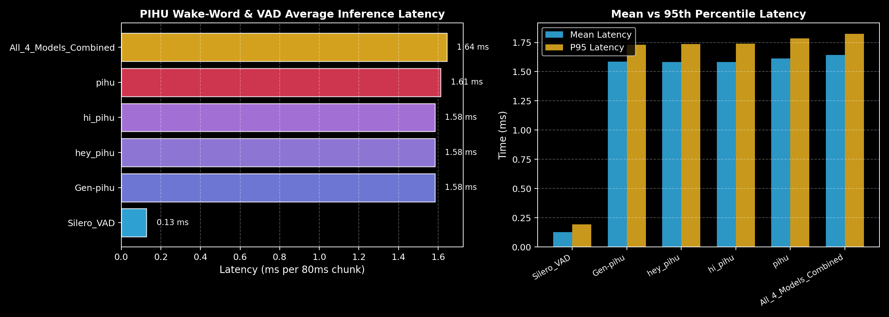

# PIHU — Desktop AI Interaction Layer

<p align="center">
  <strong>PIHU</strong> is an operating-system-level AI interaction layer designed for seamless, ambient desktop interaction.
</p>

<p align="center">
  
</p>

---

## Table of Contents

- [1. Overview & Architectural Vision](#1-overview--architectural-vision)
- [2. Complete Interaction Lifecycle](#2-complete-interaction-lifecycle)
- [3. Target Architecture & Layer Division](#3-target-architecture--layer-division)
- [4. Project Structure](#4-project-structure)
- [5. Installation & Setup](#5-installation--setup)
- [6. Running PIHU](#6-running-pihu)
  - [A. Desktop Application (Tauri + Rust + Orb UI)](#a-desktop-application-tauri--rust--orb-ui)
  - [B. PIHU Diagnostics & Wakeup CLI (`pihu.py`)](#b-pihu-diagnostics--wakeup-cli-pihupy)
- [7. Configuration Guide (`config/pihu.toml`)](#7-configuration-guide-configpihutoml)
- [8. Benchmarking & Model Performance](#8-benchmarking--model-performance)
- [9. Development & Dev Mode (`Cmd + D`)](#9-development--dev-mode-cmd--d)
- [10. Running Automated Tests](#10-running-automated-tests)

---

## 1. Overview & Architectural Vision

PIHU is **NOT** built as a conventional chatbot or a simple voice assistant with a large window. It is an ambient desktop AI interaction layer.

- **Minimalist Floating Orb**: A transparent, frameless, always-on-top desktop overlay that visually communicates PIHU's internal states.
- **Event-Driven Visual States**: The Orb does **not** rely on predetermined animation timers. Every visual transition is driven by **authoritative runtime events** from the Rust Core.
- **Audio-Reactive Dynamics**: During `LISTENING`, real-time microphone RMS audio amplitude modulates the Orb's acoustic waveforms.
- **Multi-Model Wake Detection**: Runs general (`Gen-pihu.onnx`) and phrase-specific (`hey_pihu.onnx`, `hi_pihu.onnx`, `pihu.onnx`) wake-word models simultaneously with individual thresholds.
- **Local & Low-Latency**: Silero VAD v5, OpenWakeWord, `faster-whisper` STT, rule-based Intent Engine, Action Planner, MCP Tool Layer, and local TTS.

---

## 2. Complete Interaction Lifecycle

```text
PIHU IDLE
    ↓
User says "Hey PIHU" / "Hi PIHU" / "PIHU"
    ↓
Wake word detected (confidence >= threshold)
    ↓
PIHU Orb appears (WAKE_DETECTED shockwave ripple)
    ↓
LISTENING (audio-reactive breathing waveform)
    ↓
User speaks command: "What time is it?" / "Open GitHub"
    ↓
Silero VAD detects end of speech
    ↓
TRANSCRIBING (faster-whisper local STT)
    ↓
THINKING (Intent Engine classifies command)
    ↓
PLANNING (Action Planner maps intent to execution plan)
    ↓
EXECUTING (MCP tool execution: get_time, open_url, web_search, etc.)
    ↓
RESPONDING (Low-latency TTS speaks response)
    ↓
Orb disappears / returns to dormant point
    ↓
IDLE
```

---

## 3. Target Architecture & Layer Division

```text
                    PIHU RUNTIME
                         │
        ┌────────────────┴────────────────┐
        │                                 │
   TAURI + RUST                      PYTHON AI LAYER
        │                                 │
        ├── Floating Orb Overlay          ├── AudioCapture (16kHz PCM streaming)
        ├── State Machine (Authoritative) ├── Silero VAD (v5 ONNX)
        ├── Process Supervisor            ├── OpenWakeWord (Multi-Model Engine)
        └── Stdio JSON-Lines IPC          ├── SpeechRecognizer (faster-whisper)
                                          ├── Intent Engine & Action Planner
                                          ├── MCP Tools & Client
                                          └── TextToSpeech (Local macOS / pyttsx3)
```

### Separation of Concerns:
- **Rust is the body**: Maintains authoritative runtime state, controls the Python child process lifecycle with crash detection/recovery, handles desktop window management, and routes events.
- **Python is the intelligence**: Loads and runs AI models for perception, speech boundaries, wake detection, STT transcription, intent planning, tool execution, and speech synthesis.
- **Orb is the interaction surface**: Procedural Canvas renderer that visually mirrors the real internal state.
- **MCP is the capability bridge**: Standardized interface for system actions and tool execution.

---

## 4. Project Structure

```text
capstone_pihu/
├── config/
│   └── pihu.toml                  # Centralized configuration (audio, vad, wake words, stt, tts, mcp)
├── docs/
│   └── HLA.md                     # High-level architecture specification
├── models/
│   └── wakeUp/                    # ONNX wake models & Silero VAD
│       ├── Gen-pihu.onnx          # Generalized PIHU wake model
│       ├── hey_pihu.onnx          # 'Hey PIHU' model
│       ├── hey_pihu.onnx.data     # Model weights data
│       ├── hi_pihu.onnx           # 'Hi PIHU' model
│       ├── hi_pihu.onnx.data      # Model weights data
│       ├── pihu.onnx              # 'PIHU' model
│       ├── pihu.onnx.data         # Model weights data
│       ├── pihu(g).onnx.data      # Generalized weights data
│       └── silero_vad.onnx        # Silero VAD v5 model
├── python/                        # Python AI Subprocess Layer
│   ├── main.py                    # Process entrypoint & async event loop
│   ├── requirements.txt           # Python dependencies
│   ├── audio/capture.py           # 16kHz mono audio streaming & RMS energy meter
│   ├── vad/silero.py              # Silero VAD v5 ONNX wrapper (512-sample buffer)
│   ├── wakeword/engine.py         # Multi-model wake word detector with debounce
│   ├── stt/recognizer.py          # Replaceable STT abstraction (faster-whisper)
│   ├── intelligence/
│   │   ├── intent.py              # Structured intent classifier
│   │   └── planner.py             # Action plan generator
│   ├── mcp/
│   │   ├── client.py              # Tool registry & dispatch manager
│   │   └── tools.py               # Built-in system/web tools
│   ├── tts/engine.py              # Local low-latency speech synthesis
│   └── ipc/protocol.py            # Async bidirectional stdio JSON-lines protocol
├── src-tauri/                     # Tauri + Rust Core Runtime
│   ├── Cargo.toml
│   ├── tauri.conf.json            # Floating transparent window configuration
│   ├── capabilities/default.json
│   └── src/
│       ├── lib.rs
│       ├── main.rs                # Desktop application setup & lifecycle boot
│       ├── runtime.rs             # Authoritative PihuState state machine
│       ├── process_manager.rs     # Python subprocess watchdog & recovery
│       ├── ipc.rs                 # Rust stdio event router
│       └── commands.rs            # Tauri invoke handlers & Dev commands
├── src/                           # Frontend UI
│   ├── orb.ts                     # Procedural Canvas Orb renderer
│   ├── debug.ts                   # Dev diagnostics overlay & event log stream
│   ├── main.ts                    # Tauri event bindings & state synchronization
│   └── style.css                  # Dark, minimal, non-generic styling
├── tests/                         # Unit tests
│   ├── test_vad.py
│   ├── test_wakeword.py
│   ├── test_intent.py
│   └── test_mcp.py
├── reports/                       # Benchmark plots & matrix heatmaps
│   ├── wakeword_benchmark.png
│   └── wakeword_matrix.png
├── pihu.py                        # Standalone Wakeup & Diagnostics CLI tool
├── index.html                     # Application HTML host
├── package.json                   # Frontend dependencies & scripts
├── tsconfig.json
└── vite.config.ts
```

---

## 5. Installation & Setup

### One-Command Setup (Recommended)

Run the project bootstrapper to install **all system dependencies**, create the **Python virtual environment**, install **packages**, download **AI models**, and verify **Tauri/Rust**:

```bash
python3 setup.py
```

That's it. Then launch PIHU with:

```bash
npm run tauri dev
```

---

### Setup CLI — All Flags

```bash
python3 setup.py --help
```

```
  --check        Verify prerequisites only (dry-run, no changes)
  --clean        Remove .venv, node_modules, and Rust target/ before setup
  --skip-brew    Skip Homebrew system dependency installation
  --skip-rust    Skip Rust toolchain installation
  --skip-node    Skip Node.js / npm install
  --skip-python  Skip Python venv and package installation
  --skip-models  Skip AI model downloads (use existing)
  --skip-build   Skip Tauri/Cargo check
```

**Examples:**

```bash
# Verify environment without making any changes:
python3 setup.py --check

# Reset & reinstall everything from scratch:
python3 setup.py --clean

# Skip Homebrew (already installed) and just set up Python/Node:
python3 setup.py --skip-brew

# Re-run only Python packages & model downloads:
python3 setup.py --skip-brew --skip-rust --skip-node --skip-build
```

### What `setup.py` Does

| Step | Description |
| :--- | :--- |
| **1. Python version** | Verifies Python 3.10+ |
| **2. Homebrew** | Installs `portaudio` and `ffmpeg` via Homebrew (macOS) |
| **3. Rust toolchain** | Installs `rustup` + stable toolchain + macOS targets via rustup |
| **4. Node.js / npm** | Verifies Node.js 18+ and runs `npm install` |
| **5. Python venv** | Creates `.venv`, upgrades pip, installs all `python/requirements.txt` |
| **6. AI Models** | Downloads `silero_vad.onnx` from Snakers4; verifies PIHU wake-word model files; warm-caches `faster-whisper tiny.en` |
| **7. Tauri build** | Runs `cargo check` on the Tauri Rust runtime |
| **8. Smoke test** | Imports all PIHU Python modules to confirm setup is end-to-end correct |

### Manual Prerequisites

If you prefer manual installation:
- **Rust**: https://rustup.rs
- **Node.js 18+**: `brew install node` or https://nodejs.org
- **PortAudio**: `brew install portaudio`
- **FFmpeg**: `brew install ffmpeg`

---

## 6. Running PIHU

### A. Desktop Application (Tauri + Rust + Orb UI)

To launch the full desktop application with the floating transparent Orb:

```bash
npm run tauri dev
```

#### Demo Voice Commands:
1. **Time Check**:
   - Speak: `"Hey PIHU"` *(Orb appears and enters `LISTENING`)*
   - Speak: `"What time is it?"`
   - Response: Speaks current time (e.g. *"It is 7:40 PM."*) → returns to `IDLE` (hidden).
2. **Open Application / Website**:
   - Speak: `"Hey PIHU"`
   - Speak: `"Open GitHub"`
   - Response: Opens `https://github.com` in default browser and confirms via speech.
3. **Web Search**:
   - Speak: `"Hey PIHU, search for Rust Tauri tutorials"`
   - Response: Opens Google search for the query.

---

### B. PIHU Diagnostics & Wakeup CLI (`pihu.py`)

[`pihu.py`](file:///Users/mayankjha/Documents/projects/capstone_pihu/pihu.py) is a standalone CLI tool for testing wake-word detection, latency benchmarking, and noise matrix evaluation.

To view all available commands and flags:
```bash
PYTHONPATH=. .venv/bin/python pihu.py --help
```

```text
  ╔════════════════════════════════════════════════════════════════════════════╗
  ║                              PIHU AI RUNTIME                               ║
  ║         Desktop AI Interaction Layer — Wakeup & Diagnostics CLI            ║
  ╚════════════════════════════════════════════════════════════════════════════╝

COMMAND MODES:
  --detect, -d          Start continuous real-time microphone wake word detector.
  --detect --full, -f   Start wake detector + execute full voice command pipeline upon detection.
  --file, -i <WAV>      Evaluate wake word detection on a WAV file & plot timeline score graph.
  --live, -l            Start interactive live VU energy meter & real-time model score bars.
  --benchmark, -b       Benchmark inference latency percentiles (min, avg, p50, p95, p99, max).
  --matrix, -m          Evaluate sensitivity & noise immunity matrix across acoustic conditions.

TUNING & FILTERS:
  --model <NAME>        Target specific model: 'Gen-pihu', 'hey_pihu', 'hi_pihu', 'pihu', or 'all'.
  --threshold, -t <VAL> Override confidence threshold (e.g. 0.55).
  --cooldown, -c <MS>   Override debounce cooldown duration in milliseconds (e.g. 2000).
  --iterations, -n <N>  Number of iterations for benchmark (default: 300).
  --no-plot             Disable generating and saving visual PNG graphs to reports/.
```

#### Examples:

```bash
# 1. Continuous real-time wake word detection on microphone:
PYTHONPATH=. .venv/bin/python pihu.py --detect

# 2. Wake detection + full voice interaction loop in terminal:
PYTHONPATH=. .venv/bin/python pihu.py --detect --full

# 3. Test only 'hey_pihu' model with custom 0.55 threshold:
PYTHONPATH=. .venv/bin/python pihu.py --detect --model hey_pihu --threshold 0.55

# 4. Analyze recorded WAV audio file and generate timeline plot:
PYTHONPATH=. .venv/bin/python pihu.py --file path/to/speech.wav

# 5. Interactive live microphone visualizer (VU meter + score bars):
PYTHONPATH=. .venv/bin/python pihu.py --live

# 6. Latency benchmark across all models:
PYTHONPATH=. .venv/bin/python pihu.py --benchmark -n 500

# 7. Threshold sensitivity & noise immunity matrix:
PYTHONPATH=. .venv/bin/python pihu.py --matrix
```

---

## 7. Configuration Guide (`config/pihu.toml`)

All system parameters, audio specifications, model paths, and individual wake thresholds are configured centrally in [`config/pihu.toml`](file:///Users/mayankjha/Documents/projects/capstone_pihu/config/pihu.toml):

```toml
[system]
debug_mode = true
log_level = "INFO"

[audio]
sample_rate = 16000
channels = 1
chunk_size = 1280       # 80ms chunks at 16kHz
input_device_index = -1 # -1 for default microphone

[vad]
model_path = "models/wakeUp/silero_vad.onnx"
threshold = 0.5
silence_timeout_ms = 1200
min_speech_duration_ms = 250
max_command_duration_ms = 8000

# Per-Model Wake Word Configuration
[wakeword]
[[wakeword.models]]
name = "Gen-pihu"
model_path = "models/wakeUp/Gen-pihu.onnx"
data_path = "models/wakeUp/pihu(g).onnx.data"
threshold = 0.50
cooldown_ms = 2000
enabled = true

[[wakeword.models]]
name = "hey_pihu"
model_path = "models/wakeUp/hey_pihu.onnx"
data_path = "models/wakeUp/hey_pihu.onnx.data"
threshold = 0.60
cooldown_ms = 2000
enabled = true

[[wakeword.models]]
name = "hi_pihu"
model_path = "models/wakeUp/hi_pihu.onnx"
data_path = "models/wakeUp/hi_pihu.onnx.data"
threshold = 0.60
cooldown_ms = 2000
enabled = true

[[wakeword.models]]
name = "pihu"
model_path = "models/wakeUp/pihu.onnx"
data_path = "models/wakeUp/pihu.onnx.data"
threshold = 0.60
cooldown_ms = 2000
enabled = true

[stt]
backend = "faster-whisper" # "faster-whisper" | "mock"
model = "tiny.en"
language = "en"
beam_size = 1

[tts]
backend = "native"         # "native" (macOS say) | "pyttsx3" | "mock"
voice = "Samantha"
rate = 185

[mcp]
enabled = true
allowed_tools = ["get_time", "get_date", "open_url", "open_application", "web_search"]
```

---

## 8. Benchmarking & Model Performance

Latency benchmarks measured on Apple Silicon (CPU):

| Model / Engine | Mean Latency | P50 (Median) | P95 | P99 | Max |
| :--- | :--- | :--- | :--- | :--- | :--- |
| **Silero VAD v5** | `0.08 ms` | `0.08 ms` | `0.11 ms` | `0.13 ms` | `0.13 ms` |
| **Gen-pihu.onnx** | `0.59 ms` | `0.54 ms` | `0.77 ms` | `1.34 ms` | `1.55 ms` |
| **hey_pihu.onnx** | `0.58 ms` | `0.53 ms` | `0.80 ms` | `1.33 ms` | `1.64 ms` |
| **hi_pihu.onnx** | `0.55 ms` | `0.51 ms` | `0.76 ms` | `1.19 ms` | `1.35 ms` |
| **pihu.onnx** | `0.56 ms` | `0.51 ms` | `0.82 ms` | `1.29 ms` | `1.63 ms` |
| **All 4 Models Combined** | **`0.89 ms`** | `0.84 ms` | `1.33 ms` | `1.60 ms` | `1.83 ms` |

*Note: With an 80ms chunk size and a combined pipeline inference time of ~0.89ms, wake-word detection utilizes less than 1.5% of a single CPU core.*

### Noise Immunity Matrix:

| Model | Digital Silence | Low White Noise | High White Noise | 1kHz Tone | 120Hz Hum | Safety Margin | Status |
| :--- | :--- | :--- | :--- | :--- | :--- | :--- | :--- |
| **Gen-pihu** | 0.0000 | 0.0000 | 0.0000 | 0.0000 | 0.0000 | `+0.5000` | **OPTIMAL** |
| **hey_pihu** | 0.0000 | 0.0000 | 0.0000 | 0.0000 | 0.0000 | `+0.6000` | **OPTIMAL** |
| **hi_pihu** | 0.0000 | 0.0000 | 0.0000 | 0.0000 | 0.0000 | `+0.6000` | **OPTIMAL** |
| **pihu** | 0.0000 | 0.0000 | 0.0000 | 0.0000 | 0.0000 | `+0.6000` | **OPTIMAL** |

---

## 9. Development & Dev Mode (`Cmd + D`)

To test and debug the Orb animations and pipeline without speaking:

1. Launch the Tauri application (`npm run tauri dev`).
2. Press **`Cmd + D`** (or click the ⚙ icon in the top right).
3. **Force State**: Click `IDLE`, `WAKE`, `LISTENING`, `TRANSCRIBE`, `THINKING`, `PLANNING`, `EXECUTING`, `RESPONDING`, or `ERROR` to inspect the visual rendering.
4. **Simulate Command**: Click quick chips (*"What time is it?"*, *"Open GitHub"*) or enter custom text to test Intent, Planner, MCP, and TTS without audio.
5. **Trigger Wake**: Simulate wake detection on demand.
6. **Live Event Stream**: Inspect timestamps and structured payloads across all subsystems (`RUNTIME`, `WAKE`, `VAD`, `STT`, `INTENT`, `MCP`, `TTS`).

---

## 10. Running Automated Tests

```bash
# Run full pytest unit test suite
PYTHONPATH=. .venv/bin/pytest tests/
```

Test coverage includes:
- `tests/test_vad.py`: Silero VAD initialization, 512-sample buffer, boundary detection.
- `tests/test_wakeword.py`: OpenWakeWord multi-model loading and score predictions.
- `tests/test_intent.py`: Intent classifier rule matching (Time, Date, URLs, Apps, Search, Identity).
- `tests/test_mcp.py`: MCP tool execution and Action Planner dispatch.

---

## License

MIT
